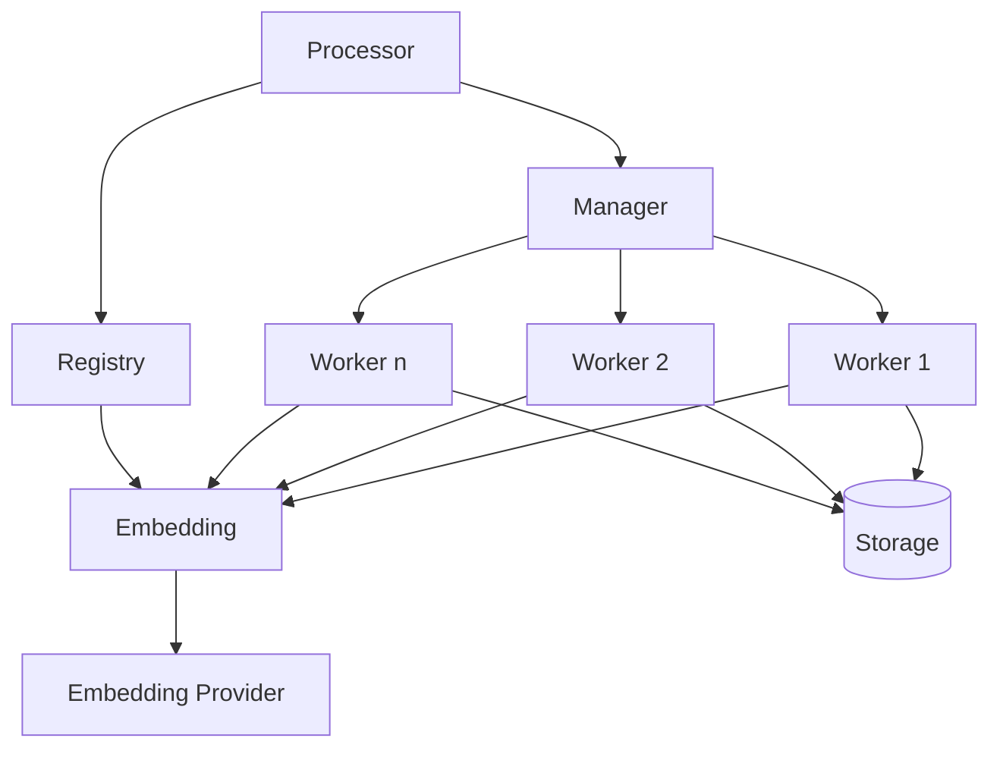
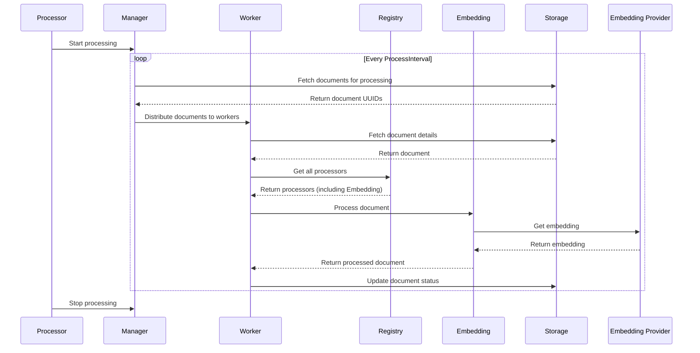

# Processor Architecture Documentation

## Overview

The processor is a crucial component of the application, responsible for processing documents, generating embeddings, and managing the overall document processing workflow. It is designed to be scalable, configurable, and extensible.

## Key Components

1. **Config**: Defines the configuration parameters for the processor.
2. **Embedding**: Handles the generation of embeddings for documents.
3. **Manager**: Orchestrates the processing cycles and manages workers.
4. **Processor**: The main entry point that initializes and controls the entire processing system.
5. **Registry**: Manages the registration and retrieval of processor units.
6. **Worker**: Performs the actual processing of individual documents.

## Architecture Diagram

## Component Details

### Config

The `Config` struct defines various parameters that control the behavior of the processor:

- `WorkerCount`: Number of concurrent workers
- `BatchSize`: Number of documents to process in each batch
- `ProcessInterval`: Time between processing cycles
- `RetryAttempts`: Number of retry attempts for failed processing
- `RetryDelay`: Delay between retry attempts
- `ShutdownTimeout`: Maximum time to wait for graceful shutdown
- `ProcessorRefreshInterval`: Interval for refreshing processor configurations

### Embedding

The `Embedding` struct is responsible for generating embeddings for documents:

- Uses an `EmbeddingProvider` to generate embeddings
- Processes documents by calling the provider's `GetEmbedding` method

### Manager

The `Manager` struct orchestrates the processing cycles:

- Manages a pool of workers
- Fetches documents for processing from storage
- Distributes documents to available workers
- Handles metrics for processing cycles

### Processor

The `Processor` struct is the main entry point for the processing system:

- Initializes and starts the Manager
- Manages the lifecycle of the processing system
- Handles graceful shutdown

### Registry

The `Registry` struct manages the registration and retrieval of processor units:

- Allows registration of different types of processors
- Provides methods to retrieve registered processors
- Handles refreshing of processor configurations

### Worker

The `Worker` struct performs the actual processing of documents:

- Fetches documents from storage
- Applies all registered processors to each document
- Updates document status after processing
- Handles retries and error reporting

## Processing Flow

## Extensibility

The architecture is designed to be extensible:

1. New processor units can be easily added by implementing the `ProcessorUnit` interface and registering them with the `Registry`.
2. The `EmbeddingProvider` can be swapped out or extended to support different embedding generation methods.
3. The `Storage` interface allows for different storage backends to be used without changing the core processing logic.

## Concurrency and Scalability

- The use of multiple workers allows for concurrent processing of documents.
- The `WorkerCount` can be adjusted based on available resources and processing needs.
- The `BatchSize` parameter allows for fine-tuning of memory usage and processing efficiency.

## Error Handling and Resilience

- Retry mechanism for failed processing attempts.
- Graceful shutdown handling to ensure in-progress work is completed.
- Use of contexts for cancellation and timeout handling.

## Observability

- Integrated logging throughout the system for debugging and monitoring.
- Metrics collection for key performance indicators:
    - Number of documents processed
    - Processing duration
    - Error counts
    - Queue size

## Conclusion

This processor architecture provides a robust, scalable, and extensible system for document processing and embedding generation. Its modular design allows for easy maintenance and future enhancements, while the use of workers and configurable parameters enables it to be optimized for different workloads and resource constraints.